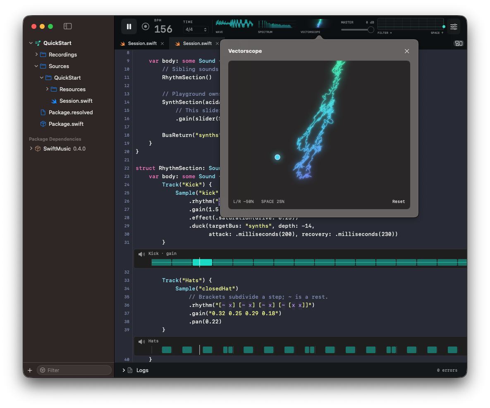

# MusicPlayground

**Make music with Swift. Shape it while it plays.**

MusicPlayground is a native macOS live music editor powered by [SwiftMusic](https://github.com/1amageek/SwiftMusic). Compose with declarative sounds, see rhythms beside your code, and perform with inline sliders, switch pads, and live audio controls. If an edit fails to compile, the last valid music keeps playing.



## Get started

Requires **Swift 6.4**, **macOS 15 or later**, and Xcode command-line tools. Swift 6.4 operation was verified on September 10, 2026.

```sh
git clone https://github.com/1amageek/MusicPlaygournd.git
cd MusicPlaygournd
./Scripts/build-app.sh
open .build/MusicPlaygournd.app
```

The build script fetches SwiftMusic and creates a locally signed app with the runtime modules needed to evaluate your music. Build on the Mac where you will use the app and keep its compiler and SDK installed. This is a source distribution; a notarized app download is not currently provided.

Choose **Create a new project**, enter its name and location, and start from the generated `Session.swift`. There is no template-selection step. Press **Play** when preparation finishes. Initial package resolution and compilation can take longer; progress and dependencies appear in the sidebar.

Sessions run local Swift with your account's permissions. Open code you trust.

## Compose with reusable sounds

`Music` describes the session. Its `body` combines `Sound` values, which can contain other sounds. Siblings play in parallel; `Track` adds a name and a mixing boundary.

```swift
import SwiftMusic

struct Session: Music {
    var body: some Sound {
        Drums()
        Bass()
    }
}

struct Drums: Sound {
    var body: some Sound {
        Track("Kick") {
            Sample("kick")
                .rhythm("x ~ x ~")
                .gain(0.7)
        }

        Track("Hats") {
            Sample("closedHat")
                .rhythm("[~ x] [~ x] [~ x] [~ [x x]]")
                .gain("0.4 [0.2 0.3] 0.4 0.2")
        }
    }
}

struct Bass: Sound {
    var body: some Sound {
        Track("Bass") {
            Synthesizer(.bandLimitedSaw)
                .notes("C2 ~ [Eb2 G2] Bb1")
                .lowPass("800")
                .gain(0.2)
        }
    }
}
```

Patterns express musical time: `x` triggers a rhythm event, `~` is a rest, brackets subdivide a step, and `x*4` repeats a hit four times. Notes and gain can use patterns too. Envelopes, filters, effects, buses, and sends shape the resulting sound.

The initial session goes further: `Session → RhythmSection / SynthSection → AcidBass / Foghorn`. It demonstrates nested sounds, patterned gain, filter envelopes, unison, reverb, and shared synth-bus ducking. Source comments credit [Switch Angel's live-coding performance](https://www.youtube.com/watch?v=HkgV_-nJOuE), which inspired the arrangement.

## Perform with inline sliders

Import `MusicPlayground` to put a slider beside its declaration. Use automatic state for a quick control, or connect a slider to your own `@State`.

```swift
import SwiftMusic
import MusicPlayground

struct Session: Music {
    @State private var level = 0.2

    var body: some Sound {
        Synthesizer(.bandLimitedSaw)
            .notes("C2 Eb2 G2 Bb2")
            .lowPass("200", resonanceQ: 4)
            .acidEnvelope(slider(0.5, in: 0...1))
            .gain(slider($level, in: 0...0.5))
    }
}
```

| Declaration | State owner |
| --- | --- |
| `slider(0.5, in: 0...1)` | MusicPlayground retains the value |
| `slider($level, in: 0...0.5)` | Your `SwiftMusic.State` receives changes |

Dragging leaves the source unchanged and updates the retained session without recompiling Swift. Invalid values or failed audio preparation keep the accepted audio playing. The default session places its tone control beside `SynthSection` and its shared synth-volume control on `BusReturn("synths")`.

Controls are declared in `Music.body`; pass their numeric values into reusable sounds. Automatic identities survive indentation changes and inserted preceding lines. Use an explicit `id:` when a control should survive changes to its declaration or when identical declarations need distinct identities.

`slider` and `acidEnvelope` belong to the editor's `MusicPlayground` library. SwiftMusic remains independent of the editor and SwiftUI. For standalone SwiftPM builds or project SourceKit completion of these host APIs, explicitly add this repository's `MusicPlayground` library product to the package dependencies.

See [InlineControls.swift](Examples/InlineControls.swift).

## Switch musical variations

Use Swift `switch` with `@State` to expose performance pads. A switch can select a sound inside a track or change whole tracks.

```swift
import SwiftMusic

enum Beat { case steady, fill }

struct Session: Music {
    @State private var beat: Beat = .steady

    var body: some Sound {
        Track("Drums") {
            switch beat {
            case .steady:
                Sample("kick").rhythm("x ~ x ~").gain(0.7)
            case .fill:
                Sample("kick").rhythm("x x [x x] x").gain(0.7)
            }
        }
    }
}
```

Supported variants are prepared before playing. Pads switch between them using the existing beat clock and a short crossfade, without compiling or rendering a new variant on the click.

See [LiveSwitch.swift](Examples/LiveSwitch.swift). Switch pads currently support compiler-resolved State properties on `Session`, local enums without associated values, and exhaustive simple cases. Banks support up to 16 combinations and 128 MiB of PCM. Inline sliders and `PerformanceEntry` cannot currently be combined with a pre-rendered switch bank.

## See and control the sound

| View or control | What it does |
| --- | --- |
| Inline, right-side, or bottom results | Show rhythm and pitch after complete sound expressions |
| Pattern highlighting | Lights individual tokens at their event times |
| Track mute | Controls each track beside its result |
| Wave | Displays stereo PCM from the audio engine |
| Spectrum + EQ | Overlays draggable EQ controls and response curves on the spectrum |
| Vectorscope | Displays Side horizontally and Mid vertically, with balance and reverb-distance control |
| Master controls | Transport, tempo, meter, volume, and a filter/space XY pad |
| Logs | Shows preparation progress and errors in a collapsible pane below the editor |

Click the header's Wave, Spectrum, or Vectorscope display to open its dedicated view. EQ and vectorscope controls include reset actions. MIDI Learn and recording are available as optional controls.

Code edits prepare replacement audio and adopt it at a musical boundary. Live master controls operate independently of code preparation. Rendering uses bounded PCM loops; unsupported combinations report errors instead of replacing valid audio.

## Work in Swift package projects

Projects use a folder-based SwiftPM structure:

```text
MyLiveSet/
├── Package.swift
├── Sources/
│   └── MyLiveSet/
│       ├── Session.swift
│       └── Resources/
└── Recordings/
```

**File → New Project** creates the directory and initial source. **Open Project** opens an existing folder containing `Package.swift`. The sidebar keeps the project and its package dependencies visible, including dependency contents. Existing directories are never overwritten by project creation.

A playable library target contains a `Session.swift` that defines `Session: Music`. Put reusable sounds in additional Swift files with their own imports. When multiple playable targets exist, select the target in the sidebar. Editing another file preserves the selected target's playback entry.

Unsaved session and helper-file buffers participate in evaluation without rewriting the saved project. Selecting `Package.swift` only displays it; manifest edits take effect when saved. Unchanged saves retain the loaded package graph and do not resolve dependencies again. SwiftPM resolves dependencies and resources from the manifest; access packaged resources with `Bundle.module`. Completion uses SourceKit-LSP and the original project graph. Inline results currently belong to the Session entry file.

## Editor shortcuts

| Shortcut | Action |
| --- | --- |
| Command–O | Open a session file |
| Shift–Command–O | Open a project |
| Command–S | Save |
| Command–Z / Shift–Command–Z | Undo / redo |
| Command–/ | Toggle line comments |
| Control–I | Format code |
| Control–Space | Request completion |
| Return / Tab | Accept completion |
| Space, outside text input | Play / pause |

The editor provides code-only line numbers, automatic indentation, four-column tab stops, per-document undo history, and configurable font size and highlighting themes in Settings.

## Development

The repository contains the native editor, audio host, renderer, and Playground-specific Swift extensions. [SwiftMusic](https://github.com/1amageek/SwiftMusic) provides the independent declarative music library.

See [DESIGN.md](DESIGN.md) for architecture and runtime contracts. Tests use Swift Testing; run the focused suite relevant to a change after building the app's runtime SDK.

## License

[MIT](LICENSE) · Copyright 2026 1amageek.
